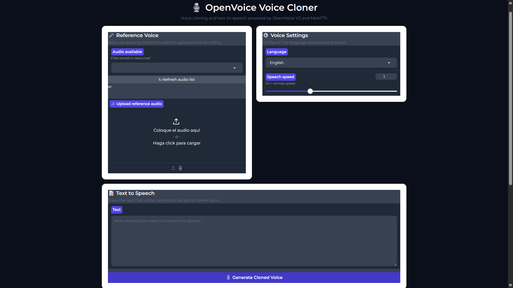

# OpenVoice Voice Cloner

A Python-based voice cloning application built with **OpenVoice V2** and **MeloTTS**.

The application generates speech from text using a reference voice and applies voice conversion using OpenVoice V2. It supports multiple languages through both a command-line interface and a web-based interface.

The current version is designed to run on **CPU**, so a dedicated NVIDIA GPU is not required.

## Features

* Voice cloning using **OpenVoice V2**
* Text-to-speech generation using **MeloTTS**
* Multilingual support:

  * English
  * Spanish
  * French
  * Chinese
  * Japanese
* Voice reference extraction from an audio file
* Adjustable speech speed
* Interactive command-line interface
* Simple web-based graphical interface
* CPU execution
* Automatic creation of the output directory
* Automatic OpenVoice V2 checkpoint detection and download
* Original OpenVoice demonstration resources included

## Supported Languages

The current application has been tested with the following MeloTTS languages:

| Language | Code | Status |
| -------- | ---- | ------ |
| English  | `EN` | Tested |
| Spanish  | `ES` | Tested |
| French   | `FR` | Tested |
| Chinese  | `ZH` | Tested |
| Japanese | `JP` | Tested |

Korean is not included in the current application.

## Requirements

### Operating System

The project has been developed and tested on **Windows**.

### Python

**Python must be installed before starting the project installation.**

Python is **not included in this repository**.

The current project was developed and tested using:

```text
Python 3.9.0
```

Using Python 3.9.x is recommended for the most predictable results.

After installing Python, verify that it is available from PowerShell:

```powershell
python --version
```

The command should return a Python 3.9.x version.

If the `python` command is not recognized, Python is either not installed or is not correctly configured in the system PATH.

### Install Git

Git must be installed before installing the project dependencies because some Python packages are downloaded directly from Git repositories.

After installing Git, verify the installation:

git --version

If the command returns the installed Git version, Git is correctly configured.


## Install FFmpeg (Windows)

FFmpeg is required by OpenVoice and Pydub to process and convert audio files.

### 1. Download FFmpeg

Download a Windows build of FFmpeg from:

https://www.gyan.dev/ffmpeg/builds/

Download the **8.x build** ZIP archive.

### 2. Extract FFmpeg

Extract the downloaded ZIP file to:

```text
C:\ffmpeg
```

Make sure the final structure looks like this:

```text
C:\ffmpeg\
└── bin\
    ├── ffmpeg.exe
    ├── ffplay.exe
    └── ffprobe.exe
```

The important file for OpenVoice is:

```text
C:\ffmpeg\bin\ffmpeg.exe
```

### 3. Add FFmpeg to the Windows PATH

Open the Windows Start menu and search for:

```text
Environment Variables
```

Select:

**Edit the system environment variables**

Then:

1. Click **Environment Variables...**
2. Under **System variables**, select `Path`.
3. Click **Edit**.
4. Click **New**.
5. Add:

```text
C:\ffmpeg\bin
```

6. Click **OK** on all the open windows.

### 4. Restart PowerShell

Close the current PowerShell window and open a **new** PowerShell window.

Verify that FFmpeg is available:

```powershell
ffmpeg -version
```

You should see information about the installed FFmpeg version.

You can also verify its location with:

```powershell
where.exe ffmpeg
```

Expected result:

```text
C:\ffmpeg\bin\ffmpeg.exe
```

> **Important:** If `ffmpeg.exe` exists in `C:\ffmpeg\bin` but PowerShell does not recognize the `ffmpeg` command, restart PowerShell after modifying the PATH. Existing terminal windows do not automatically receive changes made to the system PATH.

## Hardware

A dedicated NVIDIA GPU is **not required**.

The current tested configuration uses:

```text
Device: CPU
PyTorch: 1.13.1+cpu
```

The application automatically detects CUDA when available, but CPU execution is supported and was the primary tested configuration.

CPU processing can be significantly slower than compatible GPU execution.

## Installation

### 1. PowerShell Execution Policy

Windows PowerShell may prevent the virtual environment activation script from running because of the current execution policy.

Open PowerShell and run:

Set-ExecutionPolicy -ExecutionPolicy RemoteSigned -Scope CurrentUser

If PowerShell asks:

Do you want to change the execution policy?
[Y] Yes  [N] No  [?] Help

Select:

Y

and press Enter.

This changes the execution policy only for the current Windows user.

### 2. Clone the repository

Clone the repository from GitHub:

```powershell
git clone https://github.com/pedronav17/OpenVoice-Voice-Cloner.git
```

Enter the project directory:

```powershell
cd OpenVoice-Voice-Cloner
```

### 3. Create a virtual environment

Create a dedicated Python virtual environment:

```powershell
python -m venv .venv
```

### 3.1 OpenAI Whisper

During installation, openai-whisper==20231117 may require an alternative installation command on Windows.

If the standard installation fails, use:

```
python -m pip install --no-build-isolation openai-whisper==20231117
```

### 3.2 PyTorch — CPU version

For a CPU-only installation, install the compatible PyTorch version using:

```
python -m pip install torch==1.13.1+cpu --extra-index-url https://download.pytorch.org/whl/cpu
```

### 4. Activate the virtual environment

In PowerShell:

```powershell
.\.venv\Scripts\Activate.ps1
```

After activation, the terminal should display:

```text
(.venv)
```

before the command prompt.

### 5. Upgrade pip

It is recommended to upgrade pip inside the virtual environment:

```powershell
python -m pip install --upgrade pip
```

### 6. Install the project dependencies

Install the pinned dependencies:

```powershell
python -m pip install -r requirements-windows.txt
```

The project uses fixed package versions in order to reproduce the tested environment as closely as possible.

> **Important:** The dependency installation can take some time. Some packages may require precompiled Windows wheels or additional installation steps depending on the Python environment.

## Checkpoints

The project requires the **OpenVoice V2 converter checkpoint** and the **MeloTTS speaker embeddings**.

The repository contains the configuration and speaker embedding files required by the application, while the main OpenVoice V2 model checkpoint is excluded from Git because of its size.

The main checkpoint expected by the application is:

```text
checkpoints_v2/converter/checkpoint.pth
```

The repository includes the script:

```text
download_checkpoints.py
```

Run:

```powershell
python download_checkpoints.py
```

After the download completes, verify that this file exists:

```text
checkpoints_v2/converter/checkpoint.pth
```

The application also performs an automatic checkpoint check when it starts. If the required OpenVoice V2 checkpoint is missing, it attempts to run the download script automatically.

## Adding a Voice Reference

Place the audio file you want to use as the reference voice inside:

```text
resources/
```

For example:

```text
resources/
└── my_voice.mp3
```

The application scans the `resources` directory and displays the available audio files when it starts.

The repository contains an example reference file:

```text
resources/example_reference.mp3
```

### Supported Audio Extensions

The application currently searches for:

```text
.mp3
.wav
.m4a
.flac
```

These extensions are supported by the current file-selection code. They have not necessarily been individually tested with every possible audio encoding.

## Running the Command-Line Application

Make sure the virtual environment is activated:

```powershell
.\.venv\Scripts\Activate.ps1
```

Then run:

```powershell
python app.py
```

Alternatively:

```powershell
.\.venv\Scripts\python.exe .\app.py
```

The application will display the available reference audio files and guide you through the process.

The workflow is:

1. Select the reference audio.
2. Select the target language.
3. Enter the text to synthesize.
4. Set the speech speed.
5. Extract the reference voice characteristics.
6. Generate the base speech using MeloTTS.
7. Apply the cloned voice using OpenVoice V2.
8. Save the resulting WAV file.

### Example

When the application starts, it displays information about the current environment:

```text
============================================================
             OPENVOICE VOICE CLONER
============================================================

Python : ...
PyTorch: ...
Device : cpu
```

It then displays the available reference files:

```text
Reference files available:

--------------------------------------------------

1. example_reference.mp3
2. ...
```

After selecting the reference audio, the available languages are:

```text
Available languages:

--------------------------------------------------

1. English
2. Spanish
3. French
4. Chinese
5. Japanese
```
## Speech Speed

The application allows the speech speed to be adjusted.

For example:

```text
0.9 = slower
1.0 = normal speed
1.2 = faster
```

If no value is entered, the default speed is:

```text
1.0
```

## Output

Generated audio files are stored in:

```text
outputs/
```

The application automatically creates this directory if it does not exist.

The final cloned voice is:

```text
outputs/voice_cloned.wav
```

An intermediate audio file is also generated:

```text
outputs/tmp.wav
```

The `outputs/` directory is excluded from version control because generated audio files are local results and should not be committed to Git.

## Running the Web Interface

The project also includes a simple graphical web interface built with **Gradio**.

The web interface provides a more intuitive way to use the voice cloning application without interacting directly with the command line.

Make sure the virtual environment is activated:

```powershell
.\.venv\Scripts\Activate.ps1
```

Then run:

```powershell
python interface_app.py
```

The application starts a local web server and should automatically open the interface in your default web browser.

If the browser does not open automatically, copy the local URL displayed in the PowerShell terminal and paste it into your browser.

The interface is available at:

```text
http://127.0.0.1:7860
```

### Web Interface

The interface provides an intuitive way to:

* Select a reference voice.
* Choose the target language.
* Enter the text to synthesize.
* Adjust the speech speed.
* Generate the cloned voice.
* Access the resulting audio.



The web interface is designed to make the application easier to use without requiring command-line interaction.

## 🎥 Project Demo

[](https://youtu.be/0S_V-4zA4EQ)

**Watch the complete project demonstration on YouTube.**

## Testing

The repository includes:

```text
test_clone.py
```

This script provides a fixed test configuration for verifying the OpenVoice V2 voice conversion pipeline.

The test uses:

```text
resources/example_reference.mp3
```

and the Spanish MeloTTS speaker embedding:

```text
checkpoints_v2/base_speakers/ses/es.pth
```

Run the test with:

```powershell
python test_clone.py
```

or:

```powershell
.\.venv\Scripts\python.exe .\test_clone.py
```

The resulting audio is generated at:

```text
outputs/voice_cloned.wav
```

The test also reports information about the generated WAV file and checks that the output contains audio data.

## Project Structure

```text
OpenVoice-Voice-Cloner/

│
├── app.py
├── interface_app.py
├── test_clone.py
├── download_checkpoints.py
├── requirements-windows.txt
├── .gitignore
│
├── openvoice/
│   ├── api.py
│   ├── se_extractor.py
│   ├── models.py
│   ├── modules.py
│   └── ...
│
├── checkpoints_v2/
│   ├── converter/
│   │   ├── config.json
│   │   └── checkpoint.pth
│   │
│   └── base_speakers/
│       └── ses/
│           ├── en-au.pth
│           ├── en-br.pth
│           ├── en-default.pth
│           ├── en-india.pth
│           ├── en-newest.pth
│           ├── en-us.pth
│           ├── es.pth
│           ├── fr.pth
│           ├── jp.pth
│           └── zh.pth
│
├── resources/
│   ├── example_reference.mp3
│   └── ...
│
└── outputs/
```

## CPU Execution

The application can operate without a dedicated NVIDIA GPU.

The primary tested configuration is:

```text
Operating System: Windows

Python: 3.9.x

Device: CPU

PyTorch: 1.13.1+cpu

TorchAudio: 0.13.1

NumPy: 1.22.4

Librosa: 0.9.1
```

The application automatically detects CUDA if a compatible NVIDIA GPU and CUDA-enabled PyTorch installation are available.

However, GPU acceleration is not required for the current project.

## Important Notes

* Python must be installed **before** creating the virtual environment.
* Python 3.9.x is recommended because this project was developed and tested with Python 3.9.0.
* The project has been developed and tested on Windows.
* CPU execution is supported.
* Processing time depends on the computer hardware and the length of the reference audio and generated text.
* The main OpenVoice V2 checkpoint is downloaded separately because of its size.
* The `outputs/` directory is excluded from Git.
* Personal voice recordings should not be committed to the repository.
* Do not use another person's voice without appropriate permission or authorization.

## Original OpenVoice Resources

The project retains demonstration resources distributed with the original OpenVoice project inside the `resources/` directory.

These resources are included for demonstration and testing purposes.

## Project Status

**Working prototype**

The current version successfully provides both command-line and web-based interfaces for the complete voice cloning pipeline:

```text
Reference Audio

       │
       ▼

Voice Feature Extraction

       │
       ▼

MeloTTS Text-to-Speech

       │
       ▼

OpenVoice V2 Voice Conversion

       │
       ▼

Generated WAV Audio
```

The supported and tested languages are:

```text
English
Spanish
French
Chinese
Japanese
```

The current version includes:

* Command-line interface
* Web-based graphical interface
* CPU execution
* Automatic checkpoint detection
* Multilingual voice generation
* Voice reference selection
* Adjustable speech speed

Future development may focus on improving the graphical interface, performance, usability, and additional language support.

## Troubleshooting: 

### MeCab error

If you encounter an error related to:

mecabrc

or:

No such file or directory

check that UniDic Lite is installed:

pip show unidic-lite

You can reinstall it with:

```
pip install --force-reinstall unidic-lite
```

### Gradio API error

If Gradio produces an error similar to:

TypeError: argument of type 'bool' is not iterable

check the installed versions:

```
python -c "import gradio, gradio_client; print(gradio.__version__); print(gradio_client.__version__)"
```

The tested configuration is:

Gradio 4.44.1
Gradio Client 1.3.0

Also verify FastAPI, Starlette and Pydantic:

```
python -c "import fastapi, starlette, pydantic; print(fastapi.__version__); print(starlette.__version__); print(pydantic.__version__)"
```

## Verification

Check the installed dependencies with:

python -m pip check

You can also verify the main environment:

```
python -c "import torch, gradio, fastapi, pydantic; print('Torch:', torch.__version__); print('Gradio:', gradio.__version__); print('FastAPI:', fastapi.__version__); print('Pydantic:', pydantic.__version__)"
```

### Project Background

This project started from the open-source OpenVoice voice cloning technology and was adapted and configured specifically for a Windows environment.

The main focus of this project was not only implementing voice cloning, but also solving the dependency and compatibility challenges involved in running OpenVoice V2 and MeloTTS on Windows using CPU.

Particular attention was given to:

Python environment reproducibility.
CPU-based PyTorch configuration.
MeloTTS integration.
MeCab configuration.
UniDic Lite integration.
Gradio/FastAPI/Pydantic compatibility.
Creating a simple user-facing voice cloning interface.

### Important

`unidic` and `unidic-lite` are both listed in `requirements-windows.txt`, but installing the Python packages alone does **not necessarily download the complete UniDic dictionary** required by MeCab.

The dictionary download is therefore an additional setup step that may be required on Windows.

## Disclaimer

This project is intended for educational and demonstration purposes.

Only use voice cloning technology with voices for which you have the appropriate permission or authorization.

## License and Attribution

This project is based on the open-source work by MyShell AI / OpenVoice and MeloTTS.

Original OpenVoice repository:

https://github.com/myshell-ai/OpenVoice

MeloTTS:

https://github.com/myshell-ai/MeloTTS